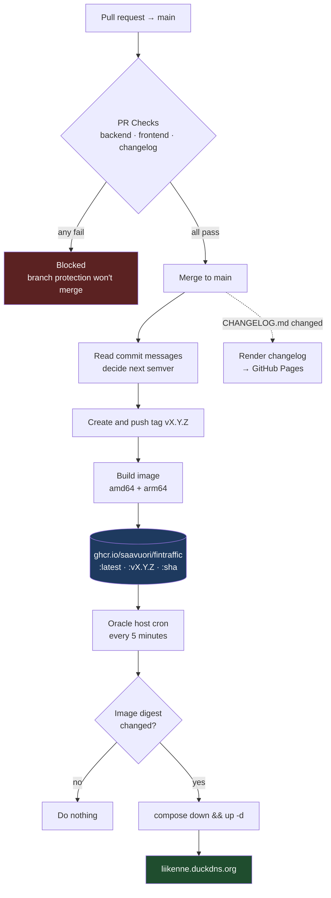
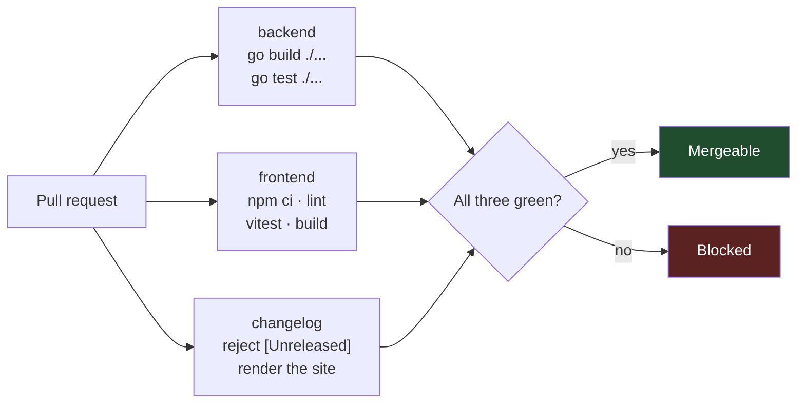
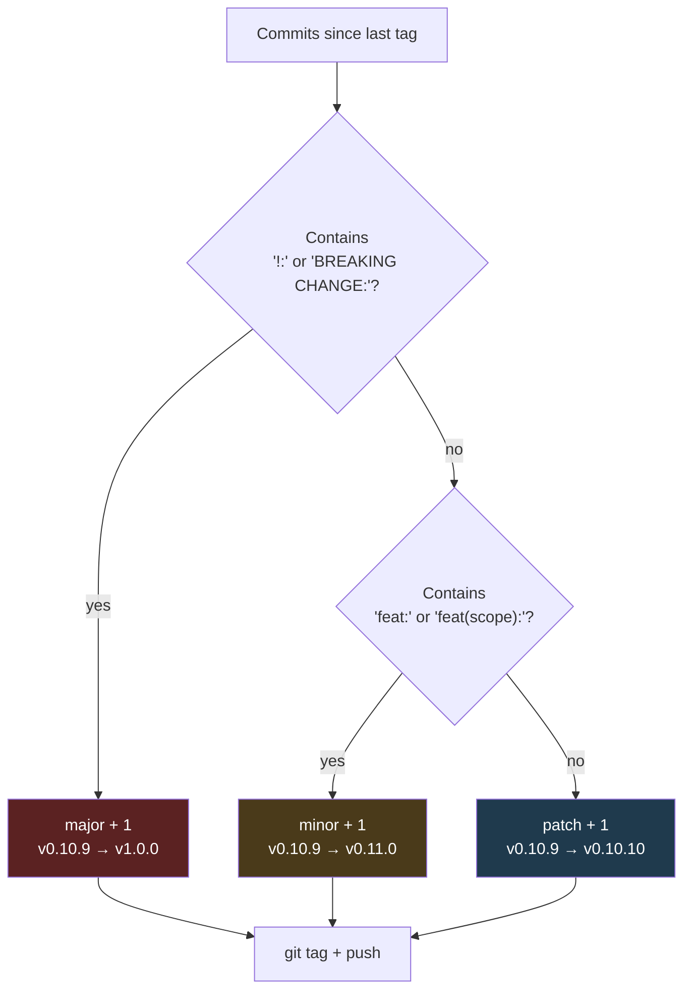
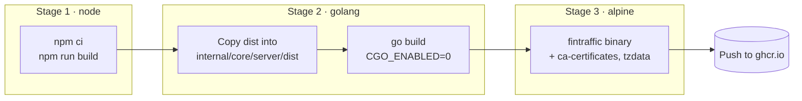
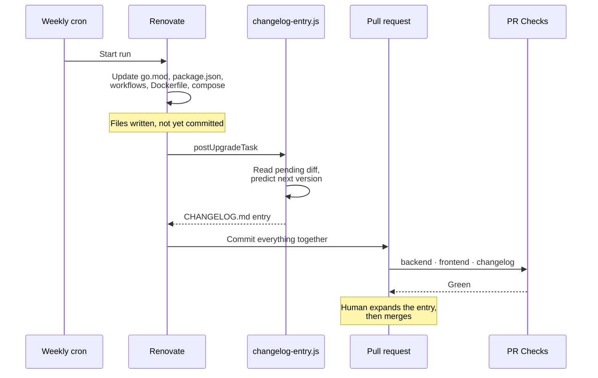
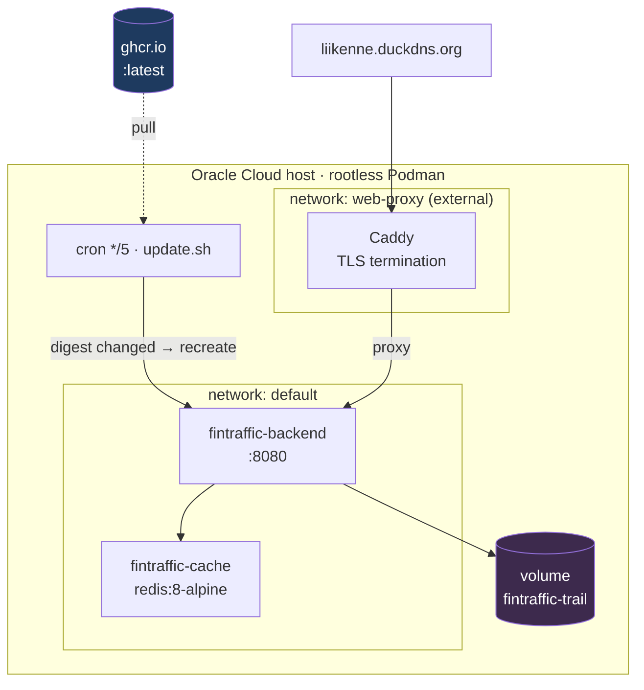

# CI/CD

How a change gets from a pull request to the container running in production, and what automates each step.

Nothing here is manual. Versions are chosen by CI from commit messages, images are built and published by CI, and the production host pulls new images on its own. The two things a human does are **write the changelog entry** and **merge the pull request**.

---

## The whole pipeline



After a merge, the release build runs, then the host picks the image up on its next cron tick — **up to 5 minutes of latency on top of the build.**

---

## The four workflows

| Workflow | Trigger | What it does | Blocking? |
|---|---|---|---|
| [`pr-checks.yml`](../.github/workflows/pr-checks.yml) | PR → `main` | Compiles and tests both halves; renders the changelog | **Yes** — required by branch protection |
| [`docker-build.yml`](../.github/workflows/docker-build.yml) | Push → `main` | Tags a version, builds and publishes the multi-arch image | No — runs after merge |
| [`deploy-pages.yml`](../.github/workflows/deploy-pages.yml) | Push → `main` touching `CHANGELOG.md` | Renders the changelog site to GitHub Pages | No |
| [`renovate.yml`](../.github/workflows/renovate.yml) | Mondays 04:00 UTC, or manual | Opens the weekly dependency PR | No |

---

## 1. PR checks — the merge gate

Three jobs run in parallel. `main` is branch-protected and requires all three by name: **`backend`**, **`frontend`**, **`changelog`**.



Two deliberate details:

- **No `paths-ignore`.** A required status check must always report *something*. If a docs-only PR skipped these jobs, the check would stay pending forever and the PR could never merge.
- **A job name is an API.** The three names above are what branch protection matches on. Never name a job in another workflow `backend`, `frontend`, or `changelog` — two jobs reporting one context makes it ambiguous which run satisfies the requirement.

The `changelog` job checks that the file *renders* and contains no `[Unreleased]` placeholder. It does **not** verify a new entry was added — that part is convention, enforced by review.

---

## 2. Release — tag, build, publish

Every push to `main` that touches shippable files runs this. Documentation-only pushes are skipped via `paths-ignore` (`README.md`, `CLAUDE.md`, `CHANGELOG.md`, `docs/**`, `scripts/**`, `.claude/**`, `deploy/**`, `.gitignore`) — those don't change the image, so they don't earn a version.

### How the version is chosen

`paulhatch/semantic-version` reads the commit messages since the last tag. **Never tag by hand.**



Anything that isn't `feat:` or breaking is a patch — including `fix:`, `chore:`, `ci:`, and `docs:`. If a PR mixes types, the largest bump wins.

### What gets built

The [Dockerfile](../Dockerfile) has three stages. The frontend is compiled to static files, copied into the Go tree where `//go:embed` expects it, and the whole app ships as **one static binary in a minimal Alpine image**.



Three things here are load-bearing:

- **`CGO_ENABLED=0`** — the Meri trail store uses a pure-Go SQLite driver. Enabling cgo breaks the static build.
- **Cross-compilation, not emulation.** Both stages are pinned to `BUILDPLATFORM` and the Go build sets `GOARCH`. Building the arm64 half under QEMU instead accounted for essentially the whole of what was then an 8-minute release build.
- **Version metadata is injected at link time** via `-ldflags -X`, which is what `/api/version` reports. A locally built binary reports `dev`.

Each build publishes three tags: `:latest`, `:vX.Y.Z`, and `:<git-sha>`.

---

## 3. Changelog site

Pushes to `main` that touch `CHANGELOG.md` re-render it through [`scripts/build-changelog.js`](../scripts/build-changelog.js) — a dependency-free Markdown-to-HTML pass — and publish to GitHub Pages.

The renderer escapes `<` and `>` globally, so **HTML comments in `CHANGELOG.md` show up as visible text**. Don't use them as markers.

---

## 4. Dependency updates

Renovate runs self-hosted on a weekly cron. Everything non-major arrives as **one grouped pull request** across all managers; majors come separately.



The entry lands *inside* Renovate's own commit rather than as a later push. That's what lets Renovate keep rebasing the branch — so if another PR merges first, the entry is regenerated and the predicted version corrects itself.

What the generator writes is **factual only**:

> **Go modules updated**: `github.com/redis/go-redis/v9` 9.21.0 → 9.22.0.

Compare that to what the same bump deserves once a human explains it — that those releases fix connection-pool races that matter precisely when Redis goes away and comes back, which is the failure mode the in-memory fallback exists for. **Expanding the entry is the reviewer's job**; the generator only removes the blank page.

Adding a new kind of pinned version means adding a pattern to `SOURCES` in [`scripts/changelog-entry.js`](../scripts/changelog-entry.js).

> **Requires a `RENOVATE_TOKEN` secret, and it cannot be `GITHUB_TOKEN`.** PRs opened with the built-in token don't trigger `pull_request` workflows, so the three required checks would never report and every dependency PR would sit blocked. See "Dependency updates" in the [README](../README.md).

---

## Deployment

No deploy step exists in CI. The host pulls.



Two scripts in [`deploy/`](../deploy):

- **`install.sh`** — idempotent install/update. Writes the compose file and `update.sh`, registers the cron, ensures the `web-proxy` network and trail volume exist, recreates the stack, and verifies trail recording came up. Run it for first install and **whenever the compose changes** (env vars, volumes, ports).
- **`update.sh`** — image-only refresher on a 5-minute cron. Pulls `:latest`, compares the image digest against the running container, and does a full `down`/`up -d` only when they differ. It never touches the compose file, so config drift is fixed by re-running `install.sh`.

Notes worth carrying:

- **The backend publishes no ports.** Caddy reaches it over the shared external `web-proxy` network. Caddy lives in a different stack and only picks up config changes on `caddy reload`.
- **Full `down`/`up` is deliberate** — it's the only reliable recreate under rootless Podman. Watchtower is not used; it's incompatible with rootless Podman.
- **Redis is a cache, not a store.** The app runs fine without it via an in-memory fallback. The only persistent data is the Meri trail SQLite database on the `fintraffic-trail` named volume, mounted `:Z` for SELinux.

---

## Versioning and the changelog

CI owns versions, but the changelog entry is written *before* the version exists — so the heading is a prediction.

**To write one:** read the top heading in `CHANGELOG.md`, apply the bump rule above to your commit type, and add your heading *above* it with today's date.

```
## [v0.10.10] - 2026-07-25     ← yours, predicted

## [v0.10.9] - 2026-07-25      ← current top
```

The prediction can go stale: if another PR merges first, it takes the number you predicted. Renovate's own PRs self-correct on rebase, but a hand-written entry doesn't — **fix the heading in a follow-up rather than leaving it mismatched.** Letting these drift is how the v0.6.1–v0.8.0 gap happened, which had to be reconstructed from git history.

Never use `[Unreleased]`. CI greps for that literal string anywhere in the file and fails the build.

---

## When something goes wrong

| Symptom | Likely cause |
|---|---|
| PR stuck "pending" forever | A required check didn't report — often a duplicate job name, or a workflow that skipped |
| `changelog` job fails | `[Unreleased]` is present, or the Markdown broke the renderer |
| Merged, but no new version tag | Push only touched `paths-ignore` files — no image change, so no release |
| Tag created, image missing | The build job failed after tagging; the tag exists but nothing was published |
| New version live in ghcr but not on the host | Cron runs every 5 minutes — check `~/fintraffic/update.log` |
| Host redeployed but the app is unhealthy | `curl https://liikenne.duckdns.org/api/health` — it reports per-mode status under `modes.<name>` |
| Renovate opens no PRs | `RENOVATE_TOKEN` missing or expired; the workflow fails loudly on the missing secret |
| Action version bumps fail, others succeed | The token lacks `workflows: write` |
| `/api/version` reports `dev` | Built locally — ldflags metadata is only injected by CI |
